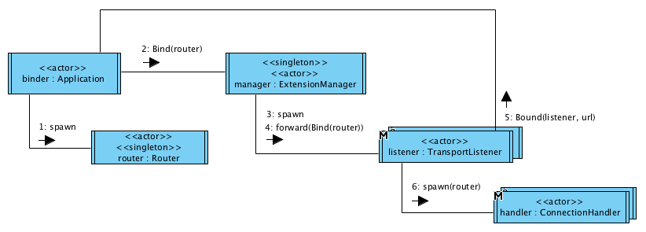

# Router
Akka Wamp provides you with a router that can be either launched as standalone server process or embedded into your application.

It provides:

* Both __broker__ (for publish/subscribe) and __dealer__ (for routed remote procedure calls) roles.
* JSON serialization


## Standalone router
[![Download][download-image]][download-url]

Download the latest router version, extract, configure and run it as standalone application:

```bash
curl https://dl.bintray.com/angiolep/universal/akka-wamp-0.11.0.tgz
tar xvfz akka-wamp-0.11.0.tar.gz
cd akka-wamp-0.11.0
vim ./conf/application.conf
./bin/akka-wamp -Dakka.loglevel=DEBUG
```


<a id="configuration"></a>


## Configuration
Either the embedded or the standalone router can be configured by applying the following settings:
 
```bash
akka {
  wamp {
    router {
      # The boolean switch to validate against strict URIs 
      # rather than loose URIs
      #
      validate-strict-uris = false
   
      # The boolean switch to NOT automatically create realms 
      # if they don't exist yet.
      #
      abort-unknown-realms = false
   
      # The boolean switch to drop offending messages (e.g. 
      # not deserializable or against the protocol).
      #
      # By default, offending messages will cause session to be
      # closed and transport to be disconnected. Set this switch on 
      # if you prefer to rather drop offending messages and resume.
      #
      drop-offending-messages = false
      
      # Named transport configurations
      #
      transport {
        default {
          # Transport protocol can be:
          #
          # - tcp
          #     Raw TCP
          # - tsl
          #     Transport Secure Layer
          # - ws    
          #     WebSocket 
          # - wss
          #     WebSocket over TLS
          #
          protocol = "ws"

          # Transport subprotocol can be:
          # 
          # - wamp.2.json
          #   JSON Javascript Object Notation
          #
          # - wamp.2.msgpack
          #   Message Pack
          #
          subprotocol = "wamp.2.json"

          # The TCP interface to bind to
          #
          iface = "127.0.0.1"

          # The TCP port number (between 0 and 65536) to bind to.
          # If set to 0 the first available randome port number 
          # will be chosen
          #
          port = 8080

          # (Only for "ws" and "wss" protocols)
          # The URL path incoming HTTP Upgrade request are expected 
          # to be addressed to
          #
          path = "router"
        },
        #secure {
        #  protocol = "wss"
        #  iface = "127.0.0.1"
        #  port = 8443
        #  path = "router"
        #}
      }
    }
  }
}
```
      
Above default settings can be overridden

 * (for standalone router) by editing the ``conf/application.conf`` file
 * (for embedded router) by providing an ``application.conf`` file on the classpath,
 * by passing system properties to the Java interpreter (e.g. ``-Dakka.wamp.router.transport.default.port=9090``)


### Logging
```bash
akka {
  #
  # Following are already set by akka-wamp as default
  #
  loggers = ["akka.event.slf4j.Slf4jLogger"]
  loglevel = "INFO"
  logging-filter = "akka.event.slf4j.Slf4jLoggingFilter"
    
  # Just provide an additional logback.xml file on the classpath 
  # so to customize your loggers, appenders and patterns
  # 
}
```

### Security
TBD

## Embedded router
Make your build depend on the latest version of akka-wamp: 

```scala
scalaVersion := "2.11.8"

libraryDependencies ++= Seq(
  "com.github.angiolep" %% "akka-wamp" % "0.11.0"
  // ...
)
```


Create the Akka ``ActorSystem`` and the Akka Wamp ``Router`` actor as follows:

```scala
import akka.actor._
import akka.wamp.router._

implicit val system = ActorSystem("myapp")
val router = system.actorOf(Router.props(), "router")
```



### Bind/Unbind
To bind a router a router to a configured transport, just send a ``Bind`` command to the ``IO(Wamp)`` extension manager:

```scala
import akka.wamp._
import akka.wamp.messages._

val manager = IO(Wamp)
manager ! Bind(router, transport = "default")
```

The manager will spawn a new transport listener for the given transport name as per above configuration. Your application actor, the binder, will be notified by the manager about the outcome of the command:

```scala
override def receive: Receive = {
  case signal @ CommandFailed(cmd, ex) =>
    log.warning(s"$cmd failed because of $ex")

  case signal @ Bound(listener, url) =>
    log.debug(s"$listener bound to $url")
    // ...
    // listener ! Unbind
} 
```

On successfully bound, you'll be sent the actor reference of the transport listener actor and the URL which that actor is bound to. If you wish to unbind the listener, just the send an ``Unbind`` message.

```scala
listener ! Unbind
```

### Examples

* [EmbeddedRouterApp](https://github.com/angiolep/akka-wamp/blob/master/examples/src/main/scala/examples/EmbeddedRouterApp.scala)


## Limitations
TBD

[download-image]: https://api.bintray.com/packages/angiolep/universal/akka-wamp/images/download.svg
[download-url]: https://bintray.com/angiolep/universal/akka-wamp/_latestVersion
