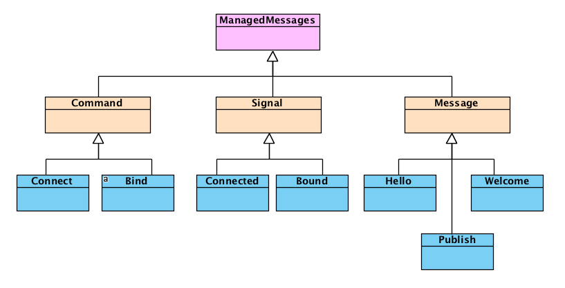

# Messages
AkkaWamp provides you with an object-oriented representation of all of its managed messages.

```scala
import akka.wamp.messages._
```

You'll get classes representing both internal commands/signals and WAMP messages carried over the network transport, such as [Hello](#Hello), [Welcome](#Welcome), [Publish](#Publish), etc. that can be sent to (or received from) Akka actors.



<a name="message-type"></a>
```
 +-----+----------------+------+------+------+------+-------+--------+
 | Cod |    Message     | Pub  | Brk  | Subs | Calr | Dealr | Callee |
 +-----+----------------+------+------+------+------+-------+--------+
 |  1  |    "HELLO"     |  Tx  |  Rx  |  Tx  |  Tx  |   Rx  |   Tx   |
 |  2  |   "WELCOME"    |  Rx  |  Tx  |  Rx  |  Rx  |   Tx  |   Rx   |
 |  3  |    "ABORT"     |  Rx  | TxRx |  Rx  |  Rx  |  TxRx |   Rx   |
 |  6  |   "GOODBYE"    | TxRx | TxRx | TxRx | TxRx |  TxRx |  TxRx  |
 |     |                |      |      |      |      |       |        |
 |  8  |    "ERROR"     |  Rx  |  Tx  |  Rx  |  Rx  |  TxRx |  TxRx  |
 |     |                |      |      |      |      |       |        |
 |  16 |   "PUBLISH"    |  Tx  |  Rx  |      |      |       |        |
 |  17 |  "PUBLISHED"   |  Rx  |  Tx  |      |      |       |        |
 |     |                |      |      |      |      |       |        |
 |  32 |  "SUBSCRIBE"   |      |  Rx  |  Tx  |      |       |        |
 |  33 |  "SUBSCRIBED"  |      |  Tx  |  Rx  |      |       |        |
 |  34 | "UNSUBSCRIBE"  |      |  Rx  |  Tx  |      |       |        |
 |  35 | "UNSUBSCRIBED" |      |  Tx  |  Rx  |      |       |        |
 |  36 |    "EVENT"     |      |  Tx  |  Rx  |      |       |        |
 |     |                |      |      |      |      |       |        |
 |  48 |     "CALL"     |      |      |      |  Tx  |   Rx  |        |
 |  50 |    "RESULT"    |      |      |      |  Rx  |   Tx  |        |
 |     |                |      |      |      |      |       |        |
 |  64 |   "REGISTER"   |      |      |      |      |   Rx  |   Tx   |
 |  65 |  "REGISTERED"  |      |      |      |      |   Tx  |   Rx   |
 |  66 |  "UNREGISTER"  |      |      |      |      |   Rx  |   Tx   |
 |  67 | "UNREGISTERED" |      |      |      |      |   Tx  |   Rx   |
 |  68 |  "INVOCATION"  |      |      |      |      |   Tx  |   Rx   |
 |  70 |    "YIELD"     |      |      |      |      |   Rx  |   Tx   |
 +-----+----------------+------+------+------+------+-------+--------+
```


<a name="Abort"></a>

## Abort
It is the message the client receives from the router upon session opening failure. It can be deconstructed with:

* ``details: Dict``  
  It is a dictionary with additional details. It might be empty.
  
* ``reason: Uri``  
  It is the abort reason given as identifier (e.g. ``wamp.error.no_such_realm``)

<a name="CommandFailed"></a>

## CommandFailed
It is the signal message the client receives from the [manager actor](./client/index.html#extension-manager) whatever command (e.g. [Connect](#Connect) or [Bind](#Bind)) fails. It can be deconstructed with:

* ``cmd: Command``  
  It is the original command that was failed

* ``ex: Throwable``  
  It is the exception thrown.


<a name="Connect"></a>

## Connect
It's the command message your client application sends to the [manager actor](./client/index.html#extension-manager) to connect to a router. It can be constructed passing the following arguments:

* ``url: String``  
  It is the [URL](https://www.ietf.org/rfc/rfc1738.txt) of the router your client wants to connect to. Akka Wamp supports the following transport protocols:
 
    * ``tcp``  
        Transmission Control Protocol
    * ``tsl``  
        Transport Secure Layer
    * ``ws``  
        WebSocket 
    * ``wss``  
        WebSocket over TLS
        
* ``format: String``  
  It is the format (textual or binary) to be used by connected peers to represent WAMP messages when they are carried over the selected transport. Akka Wamp supports the following formats:
  
    * ``json``  
       (textual) [JavaScript Object Notation](http://www.json.org/)
    * ``msgpack``  
       (binary) [Message Pack](http://msgpack.org/)
       
@@@ warning
Though documented here, the actual Akka Wamp version does provide neither ``tcp``, ``tls``, ``wss`` transports nor ``msgpack`` format.
@@@  


<a name="Connected"></a>

## Connected
It's the signal message the client receives from the [manager actor](./client/index.html#extension-manager) upon successful connection to a router. It can be deconstructed with:

* ``conn: ActorRef``  
  It is the connection handler actor reference the client shall hold. That's where further messages addressed to the router shall be sent to.


<a name="Disconnected"></a>

## Disconnected
It's the signal message the client receives from the [manager actor](./client/index.html#extension-manager) upon disconnection from the router side.


<a name="Error"></a>

## Error
It is the message the client receives from the router when a request cannot be fulfilled. It can be deconstructed to the following arguments:

* ``requestType: Int``  
  It is the [message type](#message-type) of the original request.

* ``requestId: Id``  
  It is the identifier of the original request
  
* ``details: Dict``  
  It is the dictionary of additional details. It might be empty.
  
* ``error: Uri``  
  It is the errror given as WAMP URI (e.g. ``wamp.error.no_such_subscription``)

* ``payload: Payload``  
  It is the payload bearing application data. Refer to the [Payloads](./payloads.html) section for further details.

<a name="Goodbye"></a>

## Goodbye
It is the message the client either sends to or receives from the router when it's time to close a session. It can be constructed (deconstructed) with (to) the following arguments:

* ``reason: Uri``  
  It is the reason identifier given as WAMP URI (e.g. ``"wamp.error.close_realm"``).

* ``details: Dict``  
  It is the dictionary of additional details.


<a name="Hello"></a>

## Hello
It is the message the client sends to the router to request a new session being opened with the given realm attached. It can be constructed passing the following arguments:

* ``realm: Uri``  
  It is the realm identifier given as [WAMP URI](https://tools.ietf.org/html/draft-oberstet-hybi-tavendo-wamp-02#section-5.1.1).

* ``details: Dict``  
   It is the dictionary of additional details (such as supported roles and feature announcements). 


<a name="Publish"></a>

## Publish
It is the message the client sends to the router to publish some data. It can be constructed passing the following arguments:

* ``requestId: Id``  
  It is the unique request identifier. Akka Wamp provides you with base classes you can inherit the ``nextRequestId`` method from.

* ``topic: Uri``  
  It is the topic URI to publish to.

* ``payload: Payload``  
  It is the payload bearing application data. Refer to the [Payloads](./payloads.html) section for further details.

* ``options: Dict``  
  It is the dictionary of additional options. For example, the ``"acknowledge" -> true`` entry asks for the [Published](#Published) message being replied by the router.

```text
,---------.          ,------.          ,----------.
|Publisher|          |Broker|          |Subscriber|
`----+----'          `--+---'          `----+-----'
     |     PUBLISH      |                   |
     |------------------>                   |
     |                  |                   |
     |PUBLISHED or ERROR|                   |
     |<------------------                   |
     |                  |                   |
     |                  |       EVENT       |
     |                  | ------------------>
,----+----.          ,--+---.          ,----+-----.
|Publisher|          |Broker|          |Subscriber|
`---------'          `------'          `----------'
```

<a name="Published"></a>

## Published
It is the message the client receives from the router upon sucessful publication if client asked for an acknowledgment.

* ``requestId: Id``   
  It is the identifier from the original publication request
  
* ``subscriptionId: Id``   
  It is an identifier chosen by the router for the subscription


<a name="Subscribe"></a>

## Subscribe
It is the message the client sends to the router to subscribe to a topic. It can be constructed passing the following arguments:

* ``requestId: Id``  
  It is the unique request identifier. Akka Wamp provides you with base classes you can inherit the ``nextRequestId`` method from.

* ``topic: Uri``  
  It is the topic URI to subscribe to.

* ``options: Dict``  
  It is the dictionary of additional details.

```
,---------.          ,------.             ,----------.
|Publisher|          |Broker|             |Subscriber|
`----+----'          `--+---'             `----+-----'
     |                  |                      |
     |                  |                      |
     |                  |       SUBSCRIBE      |
     |                  | <---------------------
     |                  |                      |
     |                  |  SUBSCRIBED or ERROR |
     |                  | --------------------->
     |                  |                      |
     |                  |                      |
     |                  |                      |
     |                  |                      |
     |                  |      UNSUBSCRIBE     |
     |                  | <---------------------
     |                  |                      |
     |                  | UNSUBSCRIBED or ERROR|
     |                  | --------------------->
,----+----.          ,--+---.             ,----+-----.
|Publisher|          |Broker|             |Subscriber|
`---------'          `------'             `----------'
```


<a name="Subscribed"></a>

## Subscribed
It is the message the client receives from the router upon sucessful subscription.

* ``requestId: Id``   
  It is the identifier from the original publication request
  
* ``publicationId: Id``   
  It is an identifier chosen by the router for the publication


<a name="Welcome"></a>

## Welcome
It is the message the client receives from the router upon successful session opening. It can be deconstructed with:

* ``sessionId: Long``  
  It is the unique session identifier generated by the router as random long integer number between ``1`` and ``9007199254740992``  
  
* ``details: Dict``  
  It is the dictionary with additional details. It might be empty.

