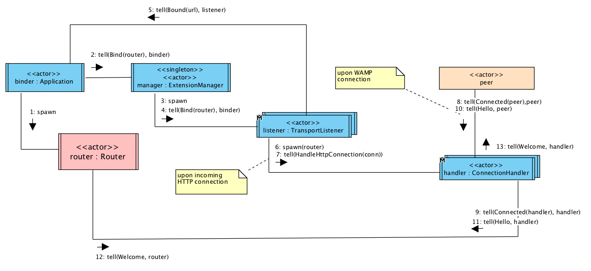

# Router
Akka Wamp provides you with a basic Router that can be either launched as standalone server process or embedded into your application. It implements:

* WAMP Basic Profile,
* Both broker and dealer roles,
* JSON serialization,
* WebSocket transport

@@@warning
Though perfectly functional, Akka Wamp Router is intended for development purposes only. You're advised to adopt production ready WAMP routers such as [Crossbar.IO](http://crossbar.io/)
@@@

## Standalone
[![Download][download-image]][download-url]

Download the latest version, extract, configure and run it as standalone application:

tgz
:   @@snip [install.sh](./tgz.sh)

## Configuration

@@snip[application.conf](../../../../core/src/main/resources/reference.conf){ #router }

[download-image]: https://api.bintray.com/packages/angiolep/universal/akka-wamp/images/download.svg
[download-url]: https://bintray.com/angiolep/universal/akka-wamp/_latestVersion

### Transports
An application can bind one or more listeners. Each listener corresponds to a named transport in the configuration file and it will bind to the configured endpoint. Usually, endpoints are configured for different schemes such as ``ws`` for WebSocket or ``wss`` for WebSocket with TLS - Transport Layer Security. Additional transport configuration falls back to the default one for missing keys (e.g. no need to repeat the ``format`` key) 

## Embedded
Create and bind an embedded router passing an actor reference factory (such as a brand new actor system or any of your actor context)

scala
:    @@snip [EmbeddedRouter.scala](../../../../examples/router/src/main/scala/LocalRouterApp.scala)

### Internals
A Binder actor spawns a Router actor to be bound to the Akka IO Wamp Manager. The manager spawns one ConnectionListener actor which listens for incoming connection requests. The listener spawns a new ConnectionHandler actor upon each connection establishment to serve a specific client. 

