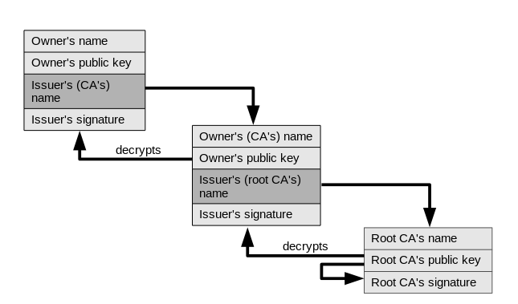

# TLS/SSL
Akka Wamp supports TLS/SSL via configuration.

## Configuration
By default, Akka Wamp loads the trust store shipped with the Java Runtime Environment.

@@snip[application.conf](../../../../core/src/main/resources/reference.conf){ #tls }

The ``cacerts`` store contains almost all the accredited CA - Certificate Authorities that any client can happily trust. Next sections explain how to customize the above settings for both router and client special needs.


## Router
To properly configure a router that binds to a TLS/SSL endpoint, it is important to make a clear distinction: either the router asks for the client's certificate or it does not.

@@@warning
Akka Wamp doesn't support routers asking for client's certificates.
@@@

### Certificate chain
In either cases, the router/server must own and present itself with a certificate having its public key attached. That certificate must have been issued and signed by some CA - Certificate Authority that any client can happily trust. The CA can be an intermediate authority or a root self-certified authority. In real world scenarios, the router/server's (owner's) certificate begins a chain of certificates, maybe with one or more intermediary issuers but certainly ending to some accredited root CA.



### Key stores
As the router does not ask for client's certificates, all it needs is to be configured with one or more key stores containing the public/private key pair, the owned certificate and the certificates of all the issuers in its certificate chain up to the root CA.
  
```hocon
ssl-config {
  keyManager {
    stores = [
      { type = "JKS", path = ${router.home}/example.com.jks, password = "changeit" },
      { type = "JKS", path = ${java.home}/lib/security/cacerts, password = "changeit" }
    ]
  }
  # trustManager ... not needed!
}
```

Such a key store can be created using the [Java KeyTool](https://docs.oracle.com/javase/8/docs/technotes/tools/windows/keytool.html), with few commands as simple as:

@@snip[mkcerts.sh](../../../../examples/router/mkcerts.sh){ #make-example-cert }

### Certificate Authorities
In real world scenarios, a certificate such as the ``example.com`` we created above, must have been issued/signed by intermediary or root CA - Certification Authorities. For that reason, whoever owns the router/server creates and submits a CSR - Certificate Signing Request to some CA chosen at its discretion.

For test purposes, the router/server owner could create a _"fake"_ self-signed root CA certificate with few commands as simple as::

@@snip[mkcerts.sh](../../../../examples/router/mkcerts.sh){ #make-ca-cert }

### Signing Request

For test purposes, the router/server owner could also create a CSR - Certificate Signing Request, so to simulate its submission and its completion, with few commands as simple as:

@@snip[mkcerts.sh](../../../../examples/router/mkcerts.sh){ #csr }


## Client
To properly configure a client that connects to a TLS/SSL router, it is important to make a clear distinction: either the router asks for the client's certificate or it does not.

@@@warning { title='Limitation' }
Akka Wamp does not support routers asking for client's certificates.
@@@


The only scenario supported by Akka Wamp is the one the router does **not** ask for any client's certificate. In this case, the client does not need to be configured with any _"keys stores"_ but rather with _"trust stores"_ only. Client's trust stores shall contain the certificates of all the issuers in the certificate chain of the router. 

### Trust stores

By default, Akka Wamp loads the trust store shipped with the Java Runtime Environment, which contains almost all the globally accredited CA - Certificate Authorities. Therefore, it's more likely you don't need to change the default configuration at all.

For test purposes, the client might connect to a router owning a certificate issued by some fake root CA, such as the one created in the above section. In this case, the client needs to be configured with a trust store containing the certificate of that fake root CA.

```hocon
ssl-config {
  trustManager {
    stores = [
      { type = "JKS", path = ${client.home}/trust-store.jks, password = "changeit" },
      { type = "JKS", path = ${java.home}/lib/security/cacerts, password = "changeit" }
    ]
  }
}
```

Such a trust store can be create running scripts like the following:


@@snip[mkcerts.sh](../../../../examples/futures/mkcerts.sh){ #make-trust-store }
