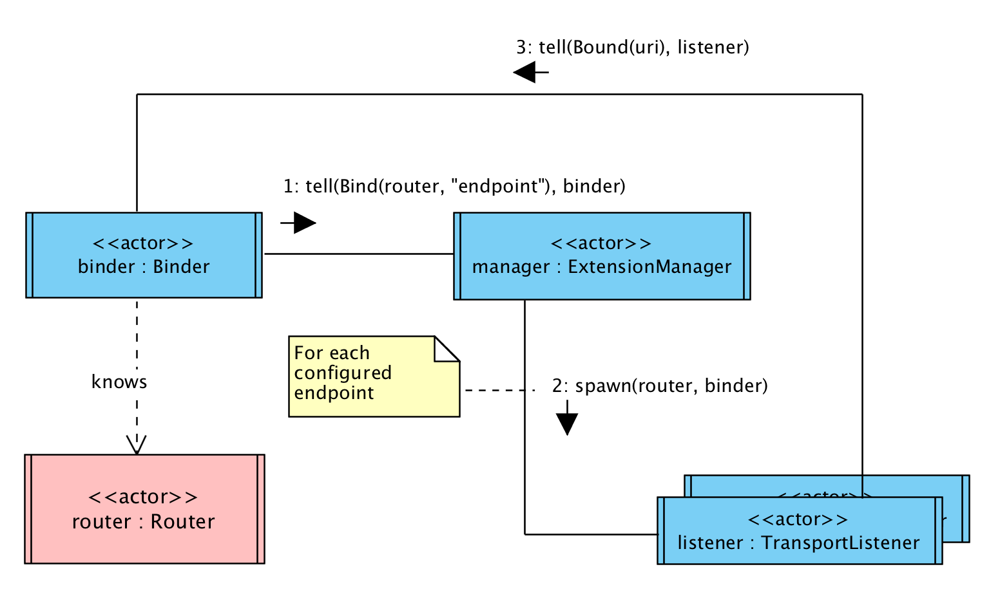

# Internals
This page summarizes the major facts of the internals of the Akka Wamp Router.

* The ``router`` is that stateful actor which performs both dealer and broker roles. It holds subscriptions and registrations. It publishes events and delivers invocations to the right clients.

* The ``manager`` actor is just an [Akka IO](https://doc.akka.io/docs/akka/current/io.html) driver for the WAMP protocol. It receives incoming ``Bind`` commands as they get sent by the ``binder`` actor. Upon receiving commands, the ``manager`` spawns a new ``listener`` actor.

* The ``binder`` is that actor which commands one or more ``Bind`` messages to the ``manager`` actor.

* The ``listeners`` are those actors spawned by the ``manager`` and bound to a given transport (e.g. WebSocket). They listen for incoming connection requests. Upon accepting a transport layer connection request, a ``listener`` actor spawns a new ``handler`` actor.

